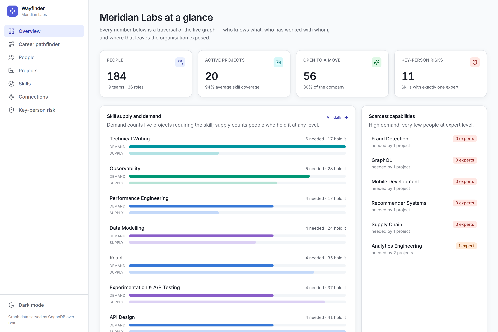
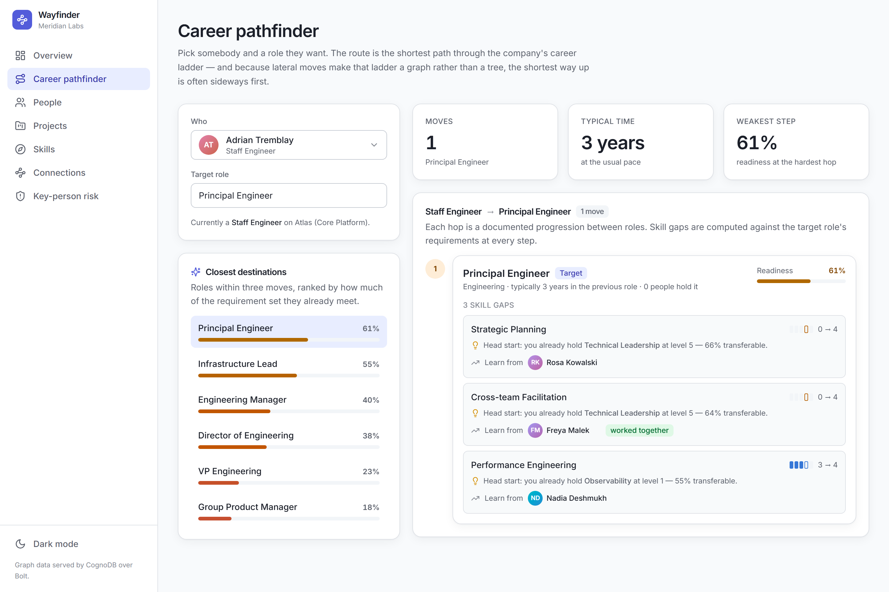
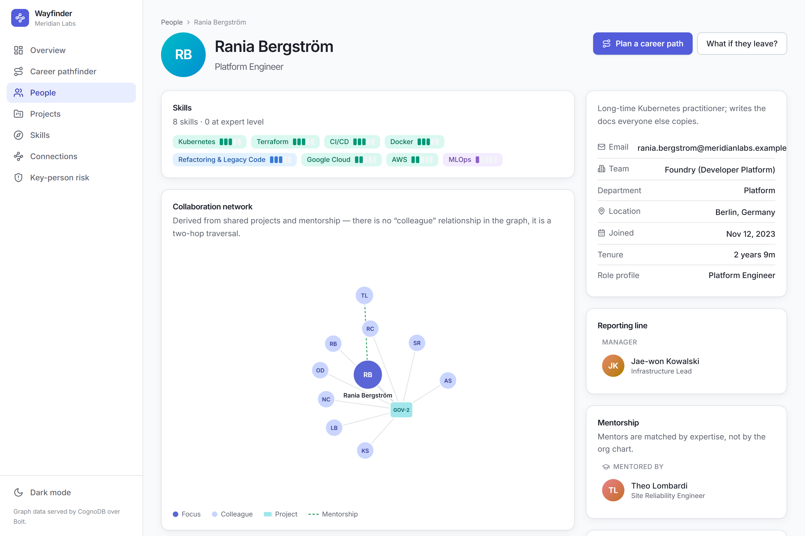
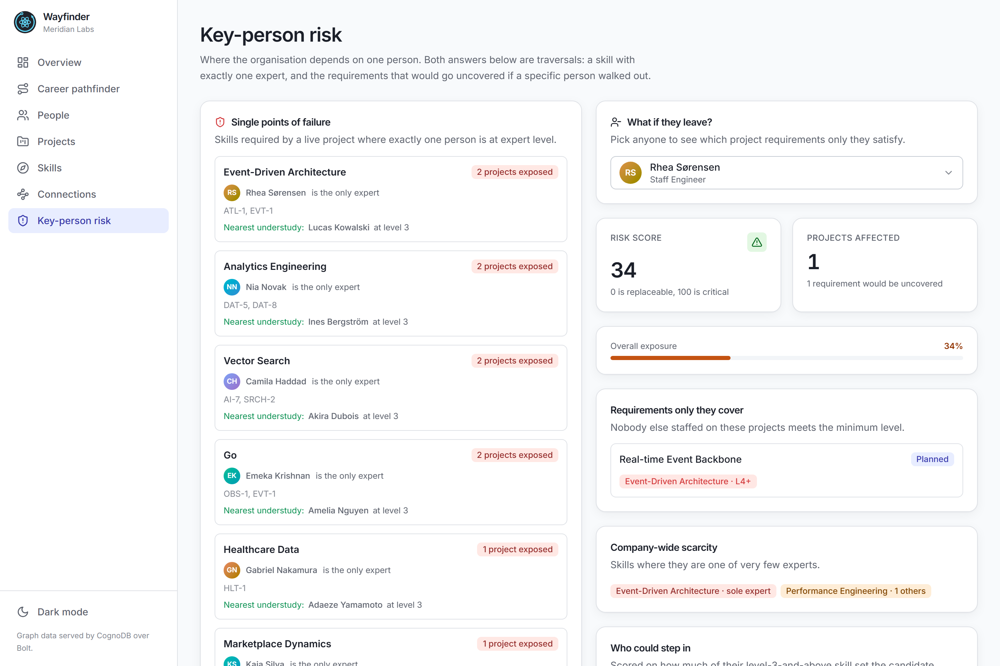
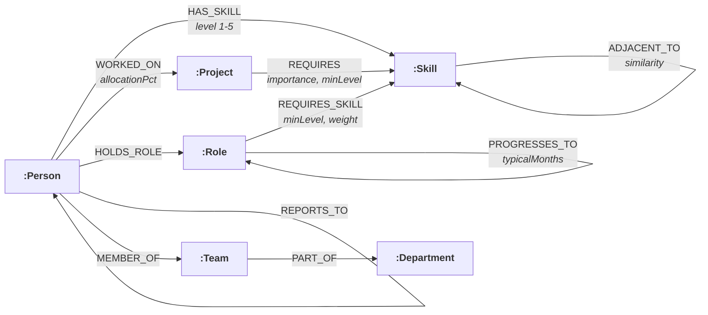

# Wayfinder

**An internal talent & mobility graph, backed by [CognoDB](https://console.cognodb.com).**

Wayfinder answers the questions an organisation cannot answer from a HR table:
who could step into this project, what is the shortest route from where someone
is to where they want to be, and what breaks if a particular person resigns on
Friday.

> **Live demo:** _<add your hosted URL here>_
> **Walkthrough video:** _<add your screen recording link here>_

---

## Contents

- [Why a graph database?](#why-a-graph-database)
- [What it does](#what-it-does)
- [Screenshots](#screenshots)
- [Data model](#data-model)
- [CognoDB compatibility](docs/cognodb-compatibility.md)
- [Getting started](#getting-started)
- [Project structure](#project-structure)
- [The queries](#the-queries)
- [Engineering notes](#engineering-notes)
- [Deployment](#deployment)
- [Scripts](#scripts)

---

## Why a graph database?

The entities here — people, skills, projects, roles — are unremarkable, and any
relational schema would hold them happily. **The value is not in the entities.
It is in the paths between them**, and paths are precisely what a relational
schema makes expensive.

Three of Wayfinder's features make that concrete.

### 1. The career ladder is a graph, not a tree

A conventional ladder is drawn as a hierarchy: junior → mid → senior → staff.
Real careers are not shaped like that. A senior engineer can become an
engineering manager, an ML engineer, a platform engineer or a security engineer.
A senior designer can become a product manager. An SRE can move into security.
Those lateral moves turn `PROGRESSES_TO` into a cyclic graph with several routes
between any two roles — and the shortest one is often *not* the one that goes
straight up.

```cypher
MATCH path = shortestPath((from:Role {id: $from})-[:PROGRESSES_TO*1..6]->(to:Role {id: $to}))
```

One line. In SQL this is a recursive CTE that has to enumerate paths, carry an
array of visited roles to break cycles, and then take a `MIN` over path length —
about thirty lines, and it re-walks the entire ladder on every call.

### 2. "Who have you worked with" is not a column

There is deliberately **no `COLLEAGUE` relationship** in this model.
Collaboration is derived:

```cypher
(:Person)-[:WORKED_ON]->(:Project)<-[:WORKED_ON]-(:Person)
```

Storing it would mean maintaining it on every staffing change. Deriving it means
it is always correct — and it gives us collaboration *distance* for free, which
is what makes the suggestions actionable. "Sofia is qualified" is a search
result. "Sofia is qualified and shipped ATL-1 with two people already on your
project" is something you can act on this afternoon.

### 3. Answers need the path, not just the endpoint

When Wayfinder says two colleagues are three degrees apart, it shows the chain —
and it finds it across **shared projects, mentorship and reporting lines at
once**, because the most useful introduction is whichever is shortest:

```cypher
MATCH path = shortestPath((a)-[:WORKED_ON|MENTORS|REPORTS_TO*1..8]-(b))
```

A relational query can tell you *that* a connection exists. Reconstructing the
route means a recursive CTE over the `UNION` of three join tables, with cycle
detection, and then unpacking an accumulated path array back into rows.

The same applies to skill adjacency. Wayfinder does not report "you lack ETL".
It reports "you already hold Spark at level 4, which is 70% transferable — ask
Priya, you shipped DAT-5 together." That sentence is three traversals
(`REQUIRES_SKILL`, `ADJACENT_TO`, `WORKED_ON`) composed in a single statement.

**Where a relational database would win:** payroll, headcount reporting,
anything that aggregates one wide table. Wayfinder does none of that — every
screen it has is a traversal.

---

## What it does

| Screen | What it answers |
| --- | --- |
| **Overview** | Headline counts, skill supply vs. demand, scarcest capabilities, most-connected colleagues. |
| **Career pathfinder** | Shortest route through the role ladder, with the skill gap, a "head start" adjacent skill, and a named mentor at every step. |
| **People** | Searchable directory; person detail with skills, projects, mentorship, reporting line and an interactive collaboration graph. |
| **Projects** | Skill coverage per project, uncovered requirements, suggested additions, and **hidden experts** ranked by social distance from the team. |
| **Skills** | Holders by proficiency, adjacency map, and which projects and roles demand it. |
| **Connections** | Degrees of separation between any two people, showing the full chain. |
| **Key-person risk** | Company-wide single points of failure, plus a "what if they leave?" simulator with replacement candidates. |

---

## Screenshots

> Replace these placeholders with real captures before submitting.

| Overview | Career pathfinder |
| --- | --- |
|  |  |

| Person detail (collaboration graph) | Key-person risk |
| --- | --- |
|  |  |

---

## Data model



The dataset is a fictional ~180-person company, **Meridian Labs**: 184 people,
73 skills, 36 roles, 32 projects and roughly 3,400 relationships — dense enough
for multi-hop traversals to be interesting, small enough for the free
(`c0`) tier.

**→ Full model, property tables and the reasoning behind each decision:
[`docs/data-model.md`](docs/data-model.md)**

---

## Getting started

### Prerequisites

- **Node.js 20.11+** and npm 10+
- A free CognoDB instance (no credit card)

### 1 · Create a CognoDB instance

1. Sign up at [console.cognodb.com/signup](https://console.cognodb.com/signup).
2. Create a free (`c0`) instance and pick a region — it provisions in under a minute.
3. From the instance's **Connect** tab, copy the connection URI
   (`bolt+s://<instance-id>.<region>.databases.cognodb.com:7687`) and the generated
   password for the `cognodb` user. **The password is shown exactly once** — save it
   before closing the dialog.

### 2 · Configure

```bash
git clone <your-repo-url>
cd wayfinder
cp .env.example .env
```

Fill in `.env`:

```dotenv
COGNODB_URI=bolt+s://<instance-id>.<region>.databases.cognodb.com:7687
COGNODB_USER=cognodb
COGNODB_PASSWORD=<your password>
COGNODB_DATABASE=neo4j
```

`.env` is gitignored. Connection details are read from the environment and are
never committed, logged or sent to the browser.

### 3 · Install, seed and run

```bash
npm install
npm run seed      # creates constraints and loads the graph (~15s)
npm run verify    # runs every headline query and prints the results
npm run dev       # API on :4000, UI on :5173
```

Open **http://localhost:5173**.

`npm run seed` is idempotent — it `MERGE`s, so running it twice changes nothing.
Use `npm run seed:reset` to wipe the database first.

To validate the generated dataset without a database at all:

```bash
npm run dataset:check
```

### Troubleshooting

| Symptom | Cause |
| --- | --- |
| `Wayfinder cannot start: the environment is not configured` | No `.env`, or a missing key. Copy `.env.example`. |
| `CognoDB rejected the credentials` | Wrong `COGNODB_USER` / `COGNODB_PASSWORD`. |
| `Could not reach CognoDB` | Instance paused or still provisioning, or a wrong URI. The UI shows a banner and keeps working. |
| Empty screens after seeding | Run `npm run verify` — it reports counts and fails loudly if the graph is empty. |

---

## Project structure

```
wayfinder/
├── shared/                     # API contract shared by both sides — one source of truth
│   └── src/{domain,api,graph}.ts
│
├── server/                     # Express + TypeScript + official Neo4j driver
│   ├── src/
│   │   ├── config/env.ts       # zod-validated environment, fails fast with a readable message
│   │   ├── db/
│   │   │   ├── driver.ts       # ONE driver per process; pool sized for the free tier
│   │   │   ├── query.ts        # CypherQuery type + read/write runners with retry
│   │   │   └── errors.ts       # driver failures → typed AppError the UI can branch on
│   │   ├── graph/
│   │   │   ├── cypher/         # every statement, one module per domain
│   │   │   └── mappers.ts      # record → DTO
│   │   ├── services/           # composition and business rules
│   │   ├── routes/             # thin HTTP layer
│   │   ├── middleware/         # zod validation + central error handler
│   │   └── app.ts
│   └── scripts/
│       ├── data/               # curated taxonomy: skills, roles, ladder, org, projects
│       ├── lib/                # deterministic generator + schema statements
│       ├── seed.ts             # batched UNWIND loader
│       └── verify.ts           # runs every headline query end to end
│
└── client/                     # React 19 + Vite + Tailwind v4
    └── src/
        ├── api/                # fetch wrapper + typed React Query hooks
        ├── components/
        │   ├── ui/             # primitives: Card, Button, Badge, Meter, states…
        │   ├── domain/         # Avatar, PersonCard, SkillChip, ProjectCard
        │   ├── layout/         # AppShell, PageHeader, DatabaseBanner
        │   ├── graph/          # force-directed SVG network
        │   └── providers/      # ThemeProvider
        ├── features/           # one folder per screen, with local components
        ├── hooks/
        ├── lib/                # cn, colour, formatting
        └── styles/index.css    # design tokens (light + dark)
```

**The component layering rule:** `ui/` knows nothing about the domain and could
be lifted into any project. `domain/` knows about people, skills and projects but
nothing about screens. `features/` composes both and owns its own data fetching.
Anything used by exactly one screen lives inside that feature's folder; the
moment a second screen needs it, it moves up a level.

---

## The queries

Highlights below. **Full annotated walkthrough:
[`docs/queries.md`](docs/queries.md)**

**Multi-hop traversal** — the shortest route through the career ladder:

```cypher
MATCH (from:Role {id: $fromRoleId})
MATCH (to:Role   {id: $toRoleId})
MATCH path = shortestPath((from)-[:PROGRESSES_TO*1..6]->(to))
RETURN [n IN nodes(path) | { id: n.id, title: n.title, level: n.level }] AS roles,
       [rel IN relationships(path) | rel.typicalMonths] AS months
```

**Awkward in SQL** — hidden experts, ranked by social distance from a project's team:

```cypher
MATCH (pr:Project {id: $id})-[req:REQUIRES]->(s:Skill)
MATCH (cand:Person)-[hs:HAS_SKILL]->(s)
WHERE hs.level >= req.minLevel AND NOT (cand)-[:WORKED_ON]->(pr)
WITH pr, cand, collect({skillId: s.id, level: hs.level}) AS matched,
     [(cand)-[:WORKED_ON]->(:Project)<-[:WORKED_ON]-(m:Person)-[:WORKED_ON]->(pr) | m] AS firstDegree
WITH pr, cand, matched, firstDegree,
     CASE WHEN size(firstDegree) > 0 THEN 1
          WHEN size([(cand)-[:WORKED_ON]->(:Project)<-[:WORKED_ON]-(:Person)
                     -[:WORKED_ON]->(:Project)<-[:WORKED_ON]-(m2:Person)-[:WORKED_ON]->(pr) | m2]) > 0 THEN 2
          ELSE 3 END AS distance
ORDER BY distance ASC
```

That five-hop pattern would be three self-joins of a membership table in SQL —
and it still would not hand back *who* connects them, which is the part that
makes the suggestion useful.

### Parameterisation

No string-concatenated Cypher exists anywhere in the codebase, and the type
system enforces it. Statements are frozen at module load through `defineQuery`,
and the runners accept nothing else:

```ts
export const GET_PERSON = defineQuery('people:detail', `MATCH (p:Person {id: $id}) …`);

await readOne(GET_PERSON, { id }, mapPerson);   // a bare string does not typecheck
```

Query text is composed only from hard-coded fragments (`personSummary('p')`),
evaluated once at import. Request input is validated by zod before it ever
becomes a parameter.

---

## Engineering notes

**One driver, one pool.** The Neo4j driver is a long-lived object that owns its
connection pool; creating one per request is the standard way to exhaust a small
instance. `db/driver.ts` holds a single instance with `maxConnectionPoolSize: 20`
— well under the free tier's 200-connection ceiling — and closes it on `SIGTERM`.

**Graceful degradation is the default path, not a fallback.** The server starts
even when CognoDB is unreachable; `/api/health` always returns 200 with the
verdict in the body, so the client can tell "the database is down" apart from
"the API is down". `db/errors.ts` maps driver failures onto typed codes —
`DATABASE_UNAVAILABLE` for a paused instance or bad URI, `QUERY_ERROR` for a
malformed statement (our bug, surfaced loudly in development). The UI shows one
banner explaining the outage with a retry, rather than seven identical red boxes.
Transient failures are retried with backoff before they ever reach the user.

**Building against a pre-1.0 engine.** CognoDB v0.9.11 speaks openCypher and
works with the Neo4j driver, but three Neo4j-flavoured constructs behave
differently — and one of them fails *silently*. A pattern predicate in `WHERE`
ignores its inline property constraint, so `WHERE (p)-[:HAS_SKILL]->(:Skill {id:
$id})` matched all 184 people instead of the correct 18. No error; just a wrong
answer that had quietly broken the skill filters. Negation and `OPTIONAL MATCH`
anti-joins are wrong in the same direction, and pattern comprehensions cannot
nest inside one another.

Every existence test in this codebase is therefore written as
`size([pattern WHERE …]) > 0`, and the display fields a person card needs are
denormalised onto the node so projections never need a nested traversal. The
findings, the probes that established them and the workarounds are written up in
[`docs/cognodb-compatibility.md`](docs/cognodb-compatibility.md). `npm run verify`
exists partly to catch exactly this class of problem: it asserts across *all*
active projects that the candidate and hidden-expert panels are non-empty,
because a silently-wrong query shows up as a plausible-looking empty list rather
than a stack trace.

**Deterministic seed data.** A `mulberry32` PRNG means the same graph on every
machine, so the numbers in this README and the screenshots stay true. Structure
comes first, randomness second: people get their role's required skills, then
adjacent skills, then a couple of unrelated interests. Projects are staffed
mostly from the best fits with a deliberate tail of weaker ones — a perfectly
staffed org would make the coverage-gap and hidden-expert queries return nothing.

**Loading, empty and error states everywhere.** Skeletons match the shape of the
content they replace. Empty states distinguish "no data" from "no results for
your filter" and offer the way out. Search is debounced so a 0.5 vCPU instance
is not asked to answer a query per keystroke.

**Accessibility and theming.** Light and dark are the same token names re-pointed,
so no component branches on theme; the choice is applied before first paint to
avoid a flash. Colour always encodes data (skill category, coverage, risk) and is
never the sole carrier of meaning. The force-directed graph is real SVG, so every
node is keyboard-focusable and announced — a canvas would have to reimplement all
of that.

---

## Deployment

The repo deploys as two services or one, whichever suits the host.

**Two services (recommended)** — API on Render/Railway/Fly, static client on
Vercel/Netlify:

```bash
# API
npm run build --workspace server
npm run start --workspace server     # honours PORT
# set COGNODB_* and CORS_ORIGIN=https://<your-client-domain>

# Client
npm run build --workspace client     # outputs client/dist
# set VITE_API_BASE_URL=https://<your-api-domain>
```

**Single service** — build both and let Express serve the SPA (no CORS needed):

```bash
npm run build
NODE_ENV=production npm start
```

`server/src/app.ts` serves `client/dist` and falls through to `index.html` for
client-side routes whenever `NODE_ENV=production` and the build exists.

Keep the CognoDB instance running while the demo is live.

---

## Scripts

| Command | What it does |
| --- | --- |
| `npm run dev` | API (`:4000`) and UI (`:5173`) together, both watching. |
| `npm run build` | Type-safe production build of both workspaces. |
| `npm start` | Run the built server. |
| `npm run seed` | Idempotent load of the graph. |
| `npm run seed:reset` | Wipe, then load. |
| `npm run verify` | Run every headline query and print the results. |
| `npm run dataset:check` | Generate and validate seed data with no database. |
| `npm run typecheck` | `tsc --noEmit` across all three workspaces. |

---

## Licence

Built as a take-home assignment. The dataset is entirely fictional; any
resemblance to real colleagues is a coincidence of the name pools.
