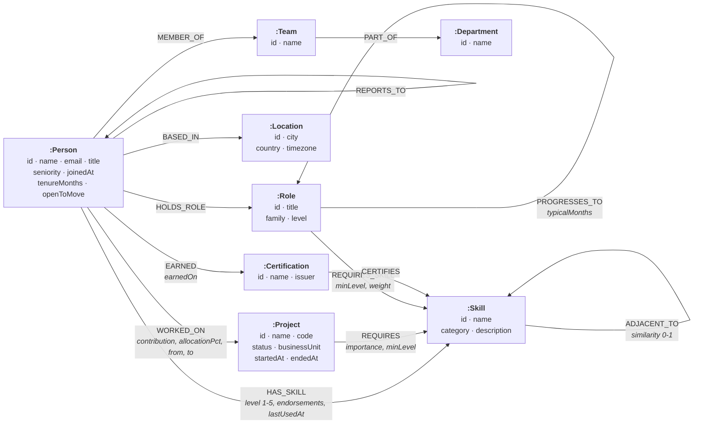

# Data model

Wayfinder models one thing: **an organisation as a network of people, what they
can do, and what they are doing it on.**

## Diagram

## Nodes

| Label            | Key  | Notable properties                                                              |
| ---------------- | ---- | ------------------------------------------------------------------------------- |
| `:Person`        | `id` | `name`, `email`, `title`, `seniority`, `joinedAt`, `tenureMonths`, `openToMove`, `avatarHue` |
| `:Skill`         | `id` | `name`, `category`, `description`                                                |
| `:Project`       | `id` | `name`, `code`, `status`, `summary`, `businessUnit`, `startedAt`, `endedAt`      |
| `:Role`          | `id` | `title`, `family`, `level`, `description`                                        |
| `:Team`          | `id` | `name`                                                                           |
| `:Department`    | `id` | `name`                                                                           |
| `:Location`      | `id` | `city`, `country`, `timezone`                                                    |
| `:Certification` | `id` | `name`, `issuer`                                                                 |

Every label has a uniqueness constraint on `id`, which also provides the index
behind every `MATCH (n:Label {id: $id})` point lookup.

## Relationships

| Type             | From → To            | Properties                                    | Why it exists                                                        |
| ---------------- | -------------------- | --------------------------------------------- | -------------------------------------------------------------------- |
| `HAS_SKILL`      | Person → Skill       | `level` (1–5), `endorsements`, `lastUsedAt`   | Proficiency is a property of the *relationship*, not of either node.  |
| `WORKED_ON`      | Person → Project     | `contribution`, `allocationPct`, `from`, `to` | The join that makes collaboration derivable.                          |
| `REQUIRES`       | Project → Skill      | `importance` (0–1), `minLevel`                | Lets coverage and gaps be computed rather than tracked by hand.       |
| `REQUIRES_SKILL` | Role → Skill         | `minLevel`, `weight`                          | Turns a job description into something queryable.                     |
| `PROGRESSES_TO`  | Role → Role          | `typicalMonths`                               | **The career ladder.** Not a tree — see below.                        |
| `ADJACENT_TO`    | Skill → Skill        | `similarity` (0–1)                            | Learning transfer, so a gap can be scored as "short climb" or "cold start". |
| `MENTORS`        | Person → Person      | `since`, `focusSkillId`                       | Follows expertise, deliberately not the org chart.                    |
| `REPORTS_TO`     | Person → Person      | —                                             | The org chart, kept separate from mentorship.                         |
| `MEMBER_OF`      | Person → Team        | —                                             |                                                                       |
| `PART_OF`        | Team → Department    | —                                             |                                                                       |
| `BASED_IN`       | Person → Location    | —                                             |                                                                       |
| `EARNED`         | Person → Certification | `earnedOn`                                  |                                                                       |
| `CERTIFIES`      | Certification → Skill | —                                            |                                                                       |

## Three modelling decisions worth defending

**1. `PROGRESSES_TO` is a graph, not a tree.**
A conventional career ladder is drawn as a tree: junior → mid → senior →
staff. Real careers are not shaped like that. A senior engineer can become an
engineering manager, an ML engineer, a platform engineer or a security
engineer; a senior designer can become a product manager; an SRE can move into
security. Those lateral edges create cycles and alternate routes, which is
exactly what makes `shortestPath` over this relationship worth running — there
is usually more than one way to reach a role, and they are not the same length.
This is the single most important modelling choice in the project, and it is
what the pathfinder screen is built on.

**2. There is no `COLLEAGUE` relationship.**
"Who have you worked with" is never stored. It is the two-hop pattern
`(:Person)-[:WORKED_ON]->(:Project)<-[:WORKED_ON]-(:Person)`, aggregated by how
many projects the pair share. Storing it would mean maintaining it on every
staffing change; deriving it means it is always correct. The same reasoning
gives us collaboration *distance*, which the hidden-experts and mentor-matching
queries use to prefer suggestions that come with an existing relationship.

**3. `ADJACENT_TO` is stored once and traversed undirected.**
The seed writes a single `(a)-[:ADJACENT_TO]->(b)` edge per pair, and every
query traverses it as `-[:ADJACENT_TO]-` without a direction. Skill similarity
is symmetric, so writing both directions would double the edge count for no
information gain — at the cost of having to keep the two copies in agreement.

## Dataset

The seed generates a fictional ~180-person product company, **Meridian Labs**:

| Entity                     | Count |
| -------------------------- | ----: |
| People                     |   184 |
| Skills                     |    73 |
| Roles                      |    36 |
| Projects                   |    32 |
| Teams                      |    19 |
| Departments                |     6 |
| Locations                  |    10 |
| Certifications             |    10 |
| **Total relationships**    | ~3,400 |

Comfortably inside the CognoDB free tier (0.5 vCPU, 256 MB RAM, 1 GB disk)
while still being dense enough that multi-hop traversals return interesting
answers rather than empty lists.

Generation is deterministic — a seeded PRNG (`mulberry32`) — so the same graph
comes out on every machine and the numbers quoted in this repo stay true.
Structure comes first and randomness is layered on top: people get their role's
required skills, then skills adjacent to those, then a couple of genuinely
unrelated interests. Projects are staffed mostly from the best-fitting people
with a deliberate tail of weaker fits, because a perfectly staffed org would
make the coverage-gap and hidden-expert queries return nothing.
